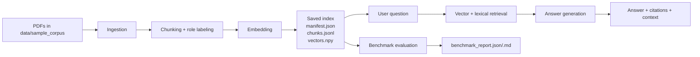

# 🧠 Multi-Modal Document Intelligence RAG
### DSAI 413 — Assignment 1

> A citation-aware, multi-modal Retrieval-Augmented Generation system that ingests real policy and financial PDF reports, extracts text, tables, figures, and image metadata, and answers questions through a Streamlit UI or CLI — with **zero required API keys**.

---

## 📌 Table of Contents

- [Overview](#overview)
- [Features](#features)
- [Project Structure](#project-structure)
- [Getting Started](#getting-started)
- [Usage](#usage)
- [How It Works](#how-it-works)
  - [Pipeline Overview](#pipeline-overview)
  - [Step-by-Step Data Flow](#step-by-step-data-flow)
  - [Key Source Files](#key-source-files)
- [Configuration](#configuration)
- [Running Tests](#running-tests)
- [Limitations](#limitations)
- [Submission Checklist](#submission-checklist)
- [References](#references)

---

## Overview

This project implements a **multi-modal RAG pipeline** that works on real-world documents — IMF Article IV reports, policy papers, and financial statements — rather than toy datasets.

It supports two operating modes:

| Mode | Embedding | Answer Generation | API Key Required? |
|------|-----------|-------------------|:-----------------:|
| **Local** | Hashing-based cosine similarity | Extractive synthesis | ❌ No |
| **Gemini** | Google AI Studio retrieval embeddings | Grounded generation | ✅ Free tier |

---

## Features

- 📄 **Multi-modal PDF ingestion** — text, tables, figures, footnotes, embedded images
- 🗂️ **Section-aware chunking** with overlap and structural preservation
- 🔍 **Hybrid retrieval** — lexical + vector ranking for accurate section-level results
- 📎 **Citation-aware answers** — every response traces back to source chunks
- 🖼️ **Optional image captioning** via Gemini for scanned or visual-heavy PDFs
- 🌐 **Streamlit UI** for browser-based demos and recordings
- 💻 **CLI interface** — `ingest`, `ask`, `chat`, `inspect`, `evaluate`
- 📊 **Benchmark runner** for assignment-style evaluation questions
- 🧪 **Unit tests** for retrieval and QA behavior

---

## Project Structure

```
mm-rag/
│
├── data/
│   ├── sample_corpus/          # Place your PDF reports here
│   └── benchmarks/
│       └── economic_report_questions.json
│
├── src/
│   └── mm_rag/                 # Core library
│       ├── ingestion/          # PDF parsing, chunking, image handling
│       ├── retrieval/          # Vector index, hybrid ranking
│       └── generation/         # Extractive + Gemini answer composer
│
├── tests/                      # Unit tests
├── storage/                    # Generated index and evaluation output
│
├── main.py                     # CLI entry point
├── streamlit_app.py            # Streamlit UI
├── .env.example                # API key template
├── TECHNICAL_REPORT.md
└── VIDEO_DEMO_SCRIPT.md
```

---

## Getting Started

### Prerequisites

- Python 3.9+
- `pip install -r requirements.txt`

### 1. (Optional) Add your free Google AI Studio key

```bash
cp .env.example .env
```

Edit `.env`:

```env
GOOGLE_API_KEY=your_google_ai_studio_key
```

> If `.env` is missing, the app runs in **local mode** automatically.

### 2. Add PDF reports to your corpus

Place at least two real policy or financial reports in `data/sample_corpus/`.

Recommended sources: IMF Article IV documents, World Bank reports, government fiscal reviews.

---

## Usage

### Build the Index

```bash
# Local mode (no API key needed)
python main.py ingest "data/sample_corpus" --backend local --index-dir storage/index

# Gemini embeddings (requires free API key)
python main.py ingest "data/sample_corpus" --backend gemini --index-dir storage/index
```

### Ask a Question

```bash
python main.py ask "What are the main fiscal risks discussed in the reports?" \
    --index-dir storage/index

# Show retrieved evidence alongside the answer
python main.py ask "Which table contains macroeconomic indicators?" \
    --index-dir storage/index --show-context
```

### Interactive Chat

```bash
python main.py chat --index-dir storage/index
# Type `exit` to quit
```

### Launch the Streamlit UI

```bash
python -m streamlit run streamlit_app.py
```

### Run the Benchmark Suite

```bash
python main.py evaluate \
    --index-dir storage/index \
    --benchmarks data/benchmarks/economic_report_questions.json \
    --output-dir storage/evaluation
```

---

## How It Works

### Pipeline Overview



### Step-by-Step Data Flow

**1. Ingestion** — `src/mm_rag/ingestion.py`

Opens each PDF with `pypdf`, extracts layout text page by page, and classifies every block by role:

| Block Type | Description |
|------------|-------------|
| `text` | Standard prose paragraphs |
| `table` | Detected table-like regions, preserved as structured evidence |
| `chart_metadata` | Figure/chart metadata and captions |
| `table_caption` | Table captions extracted separately |
| `footnote` | Notes and footnote-like content |

Embedded images are also extracted when present.

**2. Chunking** — `src/mm_rag/models.py` (`Chunk`)

Each chunk carries: document name · page number · modality · content · citation · section title · role metadata. Text is split with overlap; tables are preserved wholesale.

**3. Text Normalization** — `src/mm_rag/utils.py`

Cleans spacing, normalizes Unicode, fixes PDF token artifacts, and tokenizes for retrieval.

**4. Embedding** — `src/mm_rag/embeddings.py`

| Backend | Method | Requires Key? |
|---------|--------|:-------------:|
| `local` | Hashing-based vectorizer (fully offline) | ❌ |
| `gemini` | Google AI Studio retrieval embeddings | ✅ Free |

**5. Index Storage** — `src/mm_rag/retrieval.py`

```
storage/index/
├── manifest.json    ← index metadata
├── chunks.jsonl     ← all chunk records
└── vectors.npy      ← embedding matrix
```

**6. Retrieval**

Query is embedded → cosine similarity computed against saved vectors → lexical overlap and section overlap apply a reranking bonus → top-k chunks returned.

**7. Answer Generation** — `src/mm_rag/qa.py`

- **Local extractive:** builds answer directly from retrieved chunks with inline citations
- **Gemini:** grounded generation constrained strictly to retrieved context

Output always includes: answer text · citations · retrieved context.

**8. Benchmark Evaluation** — `src/mm_rag/evaluation.py`

Runs questions from `data/benchmarks/economic_report_questions.json` and writes:
- `storage/evaluation/benchmark_report.json`
- `storage/evaluation/benchmark_report.md`

---

### Key Source Files

| File | Role |
|------|------|
| `main.py` | CLI entry point |
| `streamlit_app.py` | Browser UI |
| `src/mm_rag/ingestion.py` | PDF parsing and block classification |
| `src/mm_rag/embeddings.py` | Local and Gemini embedding backends |
| `src/mm_rag/retrieval.py` | Vector index build, save, and search |
| `src/mm_rag/qa.py` | Answer composition and citation |
| `src/mm_rag/evaluation.py` | Benchmark runner |

---

## Configuration

| Flag | Description | Default |
|------|-------------|---------|
| `--backend` | `local` or `gemini` | `local` |
| `--index-dir` | Path to store/load the vector index | `storage/index` |
| `--show-context` | Print retrieved chunks alongside the answer | `False` |
| `--output-dir` | Benchmark evaluation output directory | `storage/evaluation` |

---

## Running Tests

```bash
python -m unittest discover -s tests -v
```

Tests cover retrieval correctness and QA behavior across both local and Gemini backends.

---

## Limitations

| Limitation | Workaround |
|------------|------------|
| Scanned/raster-only PDFs lose text in local mode | Provide a Gemini key for image captioning |
| No gold-label scoring in benchmark suite | Evaluation is qualitative; used for demo support |
| No OCR without external tooling | Install Tesseract or use Gemini vision for scanned pages |
| Assignment PDF is a poor test corpus | Use real policy/financial reports for meaningful results |


## References

- [Google Gemini API Reference](https://ai.google.dev/api)
- [Gemini Embeddings Guide](https://ai.google.dev/gemini-api/docs/embeddings)
- [Google AI Studio Free Tier](https://ai.google.dev/gemini-api/docs/billing/)
- [pypdf Documentation](https://pypdf.readthedocs.io/)

---

<div align="center">
  <sub>Built for DSAI 413 · Multi-Modal RAG · Assignment 1</sub>
</div>
